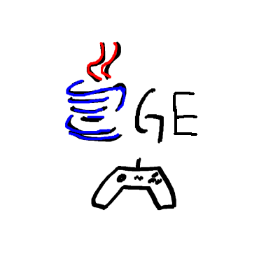

<div id="top"></div>
<!--
*** Thanks for checking out the . If you have a suggestion
*** that would make this better, please fork the repo and create a pull request
*** or simply open an issue with the tag "enhancement".
*** Don't forget to give the project a star!
*** Thanks again! Now go create something AMAZING! :D
-->


<!-- PROJECT SHIELDS -->
<!--
*** I'm using markdown "reference style" links for readability.
*** Reference links are enclosed in brackets [ ] instead of parentheses ( ).
*** See the bottom of this document for the declaration of the reference variables
*** for contributors-url, forks-url, etc. This is an optional, concise syntax you may use.
*** https://www.markdownguide.org/basic-syntax/#reference-style-links
-->
<!-- PROJECT LOGO -->
<br />
<div align="center">
  

<h3 align="center">com.asd.com.javagamemaker.javagameengine</h3>

  <p align="center">
    An awesome Game Engine to jumpstart your game projects!
    <br />
    <a href="https://github.com/Java-Game-Maker/JavaGameEngine"><strong>Explore the docs »</strong></a>
    <br />
    <br />
    <a href="https://github.com/Java-Game-Maker/JavaGameEngine/blob/main/images/demo1.gif">View Demo</a>
    ·
    <a href="https://github.com/Java-Game-Maker/JavaGameEngine/issues">Report Bug</a>
    ·
    <a href="https://github.com/Java-Game-Maker/JavaGameEngine/issues">Request Feature</a>
  </p>
  <a href="https://github.com/othneildrew/Best-README-Template">
    
  </a>
</div>


<!-- TABLE OF CONTENTS -->
<details>
  <summary>Table of Contents</summary>
  <ol>
    <li>
      <a href="#about-the-project">About The Project</a>
      <ul>
        <li><a href="#built-with">Built With</a></li>
      </ul>
    </li>
    <li>
      <a href="#getting-started">Getting Started</a>
      <ul>
        <li><a href="#prerequisites">Prerequisites</a></li>
        <li><a href="#installation">Installation</a></li>
      </ul>
    </li>
    <li><a href="#usage">Usage</a></li>
    <li><a href="#roadmap">Roadmap</a></li>
    <li><a href="#contributing">Contributing</a></li>
    <li><a href="#license">License</a></li>
    <li><a href="#contact">Contact</a></li>
    <li><a href="#acknowledgments">Acknowledgments</a></li>
  </ol>
</details>


## Examples
<h3><a href="https://github.com/Java-Game-Maker/Demo1">Link to demo1</a></h3>

<h3><a href="https://github.com/Java-Game-Maker/Demo2">Link to demo2</a></h3>


<!-- ABOUT THE PROJECT -->
## About The Project

When creating fun game projects there is a lot of code just to get you going so we created this awsome game engine to let you
go directly to the fun of gamemaking. 

Here's why:
* Your time should be focused on creating something amazing. A game that is very fun with great features
* You shouldn't be doing the same tasks over and over like creating all the hideous game making code
* You should implement DRY principles to the rest of your life :smile:


<p align="right">(<a href="#top">back to top</a>)</p>


### Built With

The com.asd.com.javagamemaker.javagameengine is built with vanila java 1.8 using the swing framework for the input and drawing aspects

* [Java](https://www.oracle.com/java/technologies/downloads/)

<p align="right">(<a href="#top">back to top</a>)</p>


<!-- GETTING STARTED -->
## Getting Started

It is very easy to start

### Prerequisites

Be sure yoy have the jre installed
* check java
  ```sh
  java -version
  ```
  If you get some sort of error message please visit https://www.java.com/sv/ and download java

### Installation

 You can clone this repo and play around with the Testing package where we test the engine and then build the artifact and import the jar to your own project. 
 Or you can download the jar file in the <a href="https://github.com/Java-Game-Maker/com.asd.com.javagamemaker.javagameengine/blob/main/out/artifacts/JavaGameEngine_jar/com.asd.com.javagamemaker.javagameengine.jar" >output folder<a> and import the jar to your project.
  
1. Clone the repo
   ```sh
   git clone https://github.com/Java-Game-Maker/com.asd.com.javagamemaker.javagameengine.git
   ```


<p align="right">(<a href="#top">back to top</a>)</p>


<!-- USAGE EXAMPLES -->
## Usage

_For more examples, please refer to the [Documentation](https://example.com)_

To get started create a main.java file where you extend the com.asd.com.javagamemaker.javagameengine class
In your public static void main(String[] args){} method

```
init();

start(null);
```
And a windows named Java Game Engine will appear with a blue background
To change the window just create a new JFrame and add the configuration you want
to it and pass it in the start method

```
init();

JFrame frame = new JFrame();
frame.setTitle("My example Title");

start(frame);
```

REMEMBER that when you do this your frame is a totaly new frame and have to set size and so on

To change the background (skybox), you can access the GAMEWORLD.setBackground(new Color(0,0,0));
GAMEWORLD is the JPanel where we draw everyting to


A example on how to use it

```
package example;

import com.asd.com.javagamemaker.javagameengine.backend.ComponentHandler;
import com.asd.com.javagamemaker.javagameengine.backend.UpdateThread;
import GameObject;
import com.asd.com.javagamemaker.javagameengine.com.asd.com.javagamemaker.javagameengine;
import Vector2;

import javax.swing.*;
import java.awt.*;


public class Main extends com.asd.com.javagamemaker.javagameengine{

    public static Ob parent;
    public static Ob child;


    public static void main(String[] args)
    {
        init();

        JFrame frame = new JFrame();
        frame.setTitle("JEL");
        UpdateThread.camera.setPosition(new Vector2(0,0));
        Ob ob1 = new Ob(new Vector2(100,100));
        Ob ob2 = new Ob(new Vector2(200,400));
        Ob ob3 = new Ob(new Vector2(400,400));

        ComponentHandler.addObject(ob1);
        ComponentHandler.addObject(ob2);
        ComponentHandler.addObject(ob3);

        start();
    }

    static class Ob extends GameObject{
        public Ob con;

        public Ob(Vector2 pos){
            setPosition(pos);
        }

        @Override
        public void onMousePressed() {
            if(Main.parent==null){
                Main.parent = this;
            }
            else{
                Main.parent.con = this;
                Main.parent = null;

            }
        }

        @Override
        public void onMouseEntered() {
            setScale(getScale().multiply(1.1f));
        }
        @Override
        public void onMouseExit() {
            setScale(getScale().devide(1.1f));
        }
        @Override
        public void draw(Graphics g) {
            super.draw(g);
            if(con!=null){
                g.drawLine((int) getPosition().getX(), (int) getPosition().getY(), (int) con.getPosition().getX(), (int) con.getPosition().getY());
            }
        }
    }

}
```

<p align="right">(<a href="#top">back to top</a>)</p>


<!-- ROADMAP -->
## Roadmap

- [ ] V1
- [ ] Relase
- [ ] 


See the [open issues](https://github.com/Java-Game-Maker/JavaGameEngine/issues) for a full list of proposed features (and known issues).

<p align="right">(<a href="#top">back to top</a>)</p>


<!-- CONTRIBUTING -->
## Contributing

Contributions are what make the open source community such an amazing place to learn, inspire, and create. Any contributions you make are **greatly appreciated**.

If you have a suggestion that would make this better, please fork the repo and create a pull request. You can also simply open an issue with the tag "enhancement".
Don't forget to give the project a star! Thanks again!

1. Fork the Project
2. Create your Feature Branch (`git checkout -b feature/AmazingFeature`)
3. Commit your Changes (`git commit -m 'Add some AmazingFeature'`)
4. Push to the Branch (`git push origin feature/AmazingFeature`)
5. Open a Pull Request

<p align="right">(<a href="#top">back to top</a>)</p>


<!-- LICENSE -->
## License

Distributed under the MIT License. See `LICENSE.txt` for more information.

<p align="right">(<a href="#top">back to top</a>)</p>


<!-- CONTACT -->
## Contact

Alfred Roos - alfred@stensatter.se

Project Link: [https://github.com/Java-Game-Maker/com.asd.com.javagamemaker.javagameengine](https://github.com/Java-Game-Maker/JavaGameEngine)

<p align="right">(<a href="#top">back to top</a>)</p>


<!-- ACKNOWLEDGMENTS -->
## Acknowledgments

Thanks to every on who has helped with this project. I want to special thanks to the following

* [One Lone Coder (olc)](https://www.youtube.com/c/javidx9/)
* [SharkooMaster](https://github.com/SharkooMaster)
* [othneildrew](https://github.com/othneildrew/Best-README-Template)


<p align="right">(<a href="#top">back to top</a>)</p>


<!-- MARKDOWN LINKS & IMAGES -->
<!-- https://www.markdownguide.org/basic-syntax/#reference-style-links -->
[contributors-shield]: https://img.shields.io/github/contributors/othneildrew/Best-README-Template.svg?style=for-the-badge
[contributors-url]: https://github.com/othneildrew/Best-README-Template/graphs/contributors
[forks-shield]: https://img.shields.io/github/forks/othneildrew/Best-README-Template.svg?style=for-the-badge
[forks-url]: https://github.com/othneildrew/Best-README-Template/network/members
[stars-shield]: https://img.shields.io/github/stars/othneildrew/Best-README-Template.svg?style=for-the-badge
[stars-url]: https://github.com/othneildrew/Best-README-Template/stargazers
[issues-shield]: https://img.shields.io/github/issues/othneildrew/Best-README-Template.svg?style=for-the-badge
[issues-url]: https://github.com/othneildrew/Best-README-Template/issues
[license-shield]: https://img.shields.io/github/license/othneildrew/Best-README-Template.svg?style=for-the-badge
[license-url]: https://github.com/othneildrew/Best-README-Template/blob/master/LICENSE.txt
[linkedin-shield]: https://img.shields.io/badge/-LinkedIn-black.svg?style=for-the-badge&logo=linkedin&colorB=555
[linkedin-url]: https://linkedin.com/in/othneildrew
[product-screenshot]: images/screenshot.png
